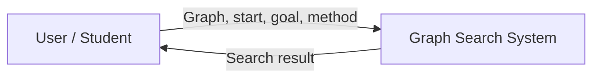
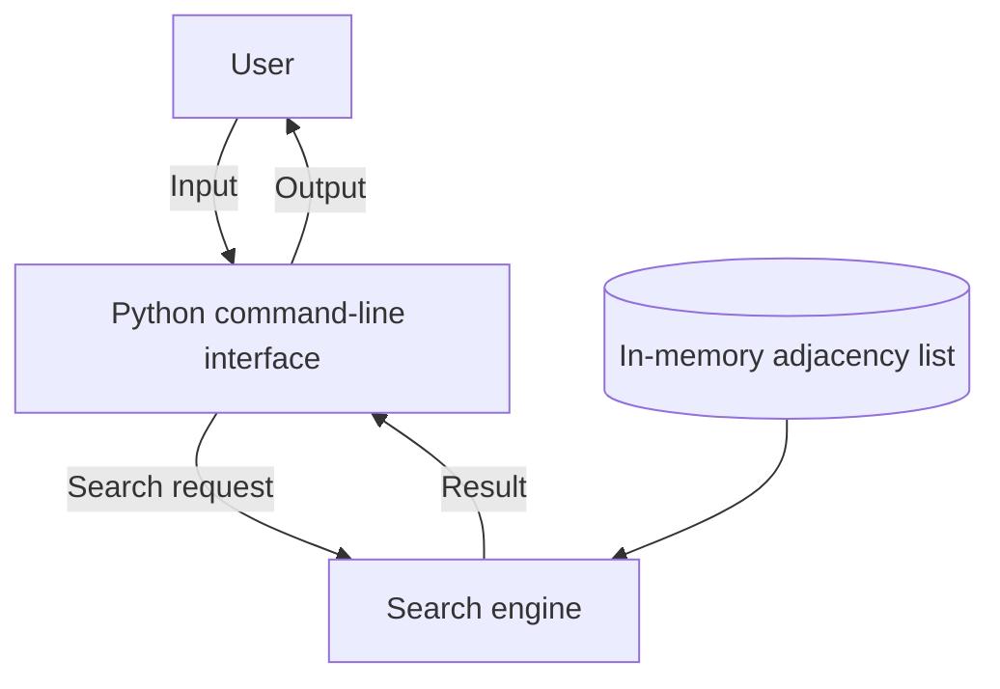

# SLE-3: Graph Search System Architecture

**Student:** Rutuja Patil  
**Project:** Graph Search using BFS and DFS

## Overview
This repository documents the architecture of the graph-search project from SLE-2. It describes the system context, logical containers, components, and search flow. Confirm all names and behaviors against your actual source code before submission.

## Goals
- Represent a graph using an adjacency list.
- Search from a start vertex to a goal vertex using BFS or DFS.
- Track visited vertices to avoid repeated processing.
- Present the search outcome and available metrics.

## Level 1 — System context


## Level 2 — Container view


## Level 3 — Component view
```mermaid
flowchart TB
    INPUT[Configuration: GRAPH, START, GOAL] --> SELECT{Algorithm selection}
    SELECT -->|BFS| BFS[bfs()]
    SELECT -->|DFS| DFS[dfs()]
    BFS --> VIS[Visited tracking]
    DFS --> VIS
    VIS --> RESULT[Result handling]
    RESULT --> OUT[Display result]
```

## Search flow
1. Load the graph and configure start and goal vertices.
2. Select BFS or DFS.
3. Initialize the frontier and visited set.
4. Remove the next vertex from the frontier.
5. If it is the goal, finish and return the result.
6. Otherwise, add unvisited neighbors and continue.
7. If the frontier becomes empty, report that the goal was not found.

## Component responsibilities
| Component | Responsibility |
|---|---|
| Graph data | Stores vertices and neighbors as an adjacency list. |
| Configuration | Holds start, goal, and algorithm selection. |
| BFS | Uses a FIFO queue to explore breadth-wise. |
| DFS | Uses a LIFO stack to explore depth-wise. |
| Visited tracking | Prevents repeated processing. |
| Result handling | Reports the outcome and counters if implemented. |

## Code-level mapping
| Code element | Role |
|---|---|
| GRAPH | Graph data |
| START / GOAL | Search configuration |
| bfs() | Breadth-first traversal |
| dfs() | Depth-first traversal |
| queue / stack | Frontier data structures |
| visited | Records discovered vertices |

## Run
Copy the actual SLE-2 Python source into this repository. If its filename is `SLE2_BFS_VS_DFS.py`, run:
```bash
python SLE2_BFS_VS_DFS.py
```
Use the real filename if it differs.

## Design decisions
- An adjacency list stores each vertex with its neighboring vertices.
- BFS uses a queue; DFS uses a stack.
- A visited set helps prevent repeated visits in cyclic graphs.
- Separate BFS and DFS functions keep the algorithms distinct and easy to compare.

## Submission checks
Verify exact function names, input method, returned values, path reconstruction (if any), and measured results against your implementation. Do not add performance claims unless supported by your profiling output.

## Reference
GitHub supports Mermaid diagrams in Markdown: https://github.blog/developer-skills/github/include-diagrams-markdown-files-mermaid/
